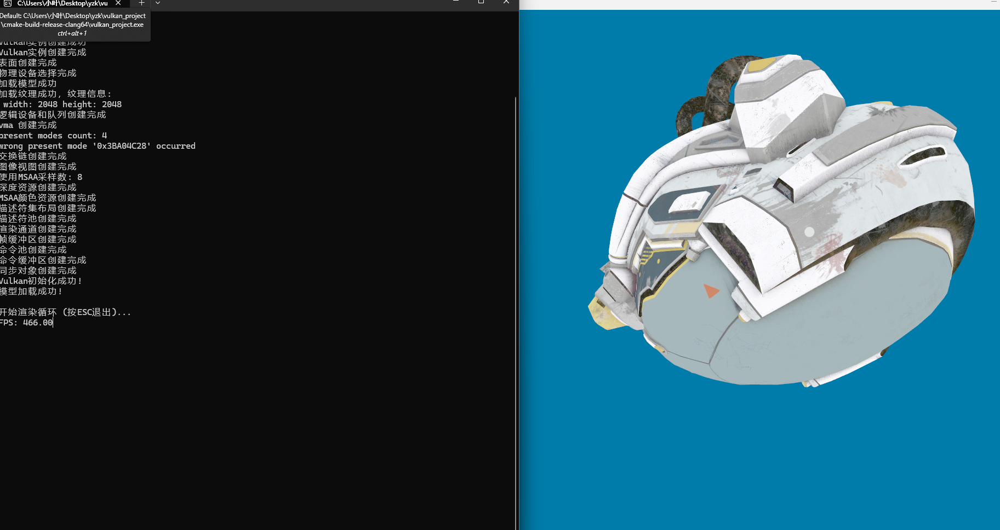
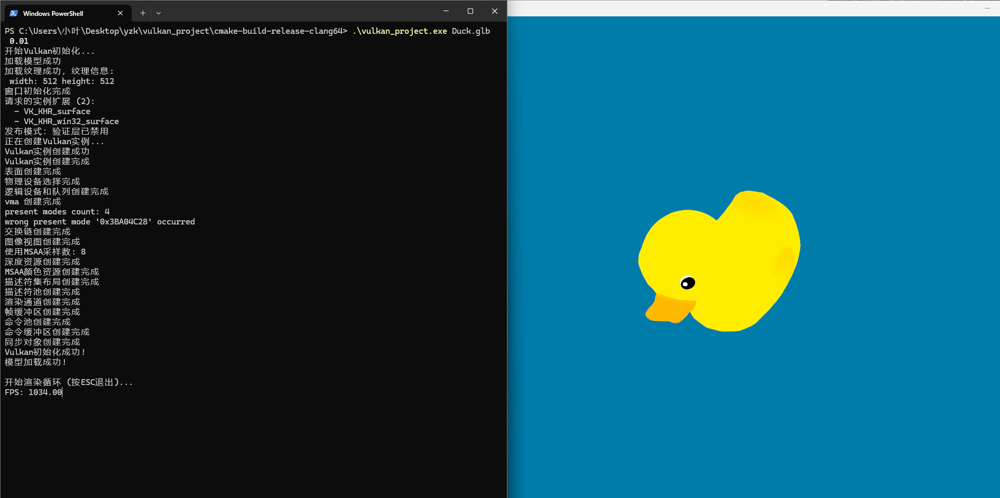

# vulkan_project
Modern C++ Vulkan study project with GLTF support and RAII-style resource management.

[](https://opensource.org/licenses/MIT)
[](https://www.vulkan.org/)
[](https://isocpp.org/)
[](https://cmake.org/)

## Features

### Core Graphics

- Vulkan 1.3 pipeline with MSAA anti-aliasing
- Dynamic viewport and scissor states
- Depth testing and color blending

### Memory Management

- VMA (Vulkan Memory Allocator) integration (via VMA)
- RAII wrappers with automatic cleanup
- enable_destruct_stack<> for deterministic resource cleanup

### Modern C++

- std::print
- std::source_location
- constexpr
- std::ranges
- aggregate initialization
- CRTP

### GLTF Support

- Implemented GLTF loading in gltf_loader

## Preview
`./vulkan_project #default start, needs DamagedHelmet.glb`

`./vulkan_project Duck.glb 0.01`


## Quick Start

### Requirements

- CMake 3.20+ 
- Vulkan SDK 1.3+
- glm 1.0+
- GLFW 3.0+
- Boost 1.0+
- Tinygltf 2.0+
- Recent Clang (e.g., 16, 17)

### Building 

```bash
    git clone https://github.com/YzK0741/vulkan_project.git
    cd vulkan_project
    mkdir build
    cd build
    cmake .. -DCMAKE_BUILD_TYPE=Release
    cmake --build .
    ./vulkan_project module_path size #or default start with no argument but needs DamagedHelmet.glb
```
If you want to try it yourself you can look up the main.cpp, the code is designed to be straightforward.

## Current Limitations

### Only Windows

### Constant Pipeline

### PBR is not ready

### May kill the gpu driver

## Visions

### CreateInfo-driven construction

### Dynamic pipeline creating

### PBR-NBR mixed rendering

### Better GLTF loading

### Concepts and template based scene graph binding

## License
MIT, look at [`LICENSE`](LICENSE)
